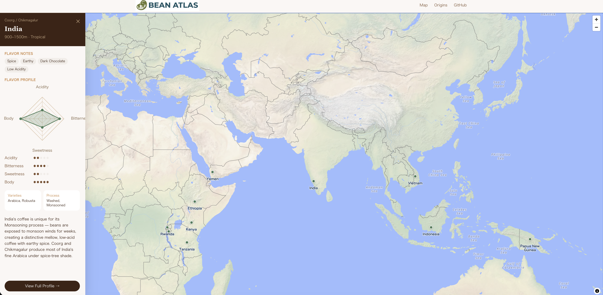

# BeanAtlas

**An interactive world map of coffee origins.**
Explore where your coffee comes from — click any origin to discover its flavor profile, altitude, varieties, and processing methods.

🌐 **[beanatlas.net](https://beanatlas.net)**



---

## Features

- 🗺️ Interactive world map powered by MapLibre GL JS + OpenStreetMap
- ☕ 20 major coffee-producing countries with detailed profiles
- 📊 Flavor indicators: acidity, bitterness, sweetness, body
- 📱 Responsive design — works on mobile and desktop

---

## Tech Stack

| Layer | Technology |
|-------|-----------|
| Frontend | Vue 3 + Vite + TypeScript |
| Styling | Tailwind CSS v4 |
| Map | MapLibre GL JS + OpenStreetMap |
| Backend | FastAPI (Python 3.12) |
| Database | SQLite (local) / PostgreSQL + PostGIS (production) |
| Server | Nginx + systemd on VPS |

---

## Project Structure

```
BeanAtlas/
├── frontend/               # Vue 3 frontend
│   └── src/
│       ├── components/     # MapView, OriginCard, FlavorIndicator
│       ├── views/          # HomeView, OriginsView, OriginDetailView
│       ├── stores/         # Pinia state management
│       ├── api/            # API client
│       └── types/          # TypeScript types
├── backend/                # FastAPI backend
│   └── app/
│       ├── main.py         # App entry point
│       ├── models.py       # SQLAlchemy models
│       ├── schemas.py      # Pydantic schemas
│       ├── seed.py         # Initial data (20 origins)
│       └── routers/        # API routes
└── deploy/                 # Deployment config
    ├── nginx.conf
    ├── api-beanatlas.service
    ├── setup-server.sh     # First-time server setup
    └── deploy.sh           # Deploy script
```

---

## Local Development

### Prerequisites

- Node.js 18+
- Python 3.12+

### Frontend

```bash
cd frontend
npm install
npm run dev
# → http://localhost:5173
```

### Backend

```bash
cd backend
python3 -m venv .venv
source .venv/bin/activate   # Windows: .venv\Scripts\activate
pip install -r requirements.txt
uvicorn app.main:app --reload
# → http://localhost:8000
# → API docs: http://localhost:8000/docs
```

The frontend dev server proxies `/api/*` to `http://localhost:8000`, so both run together without CORS issues.

---

## API

```
GET /api/v1/origins          # List all origins
GET /api/v1/origins/{slug}   # Get origin detail
GET /api/v1/health           # Health check
```

## Data Sources

Origin data compiled from SCA, ICO, and national coffee boards.
Map tiles © [OpenStreetMap](https://www.openstreetmap.org/copyright) contributors.

---

## License

MIT
